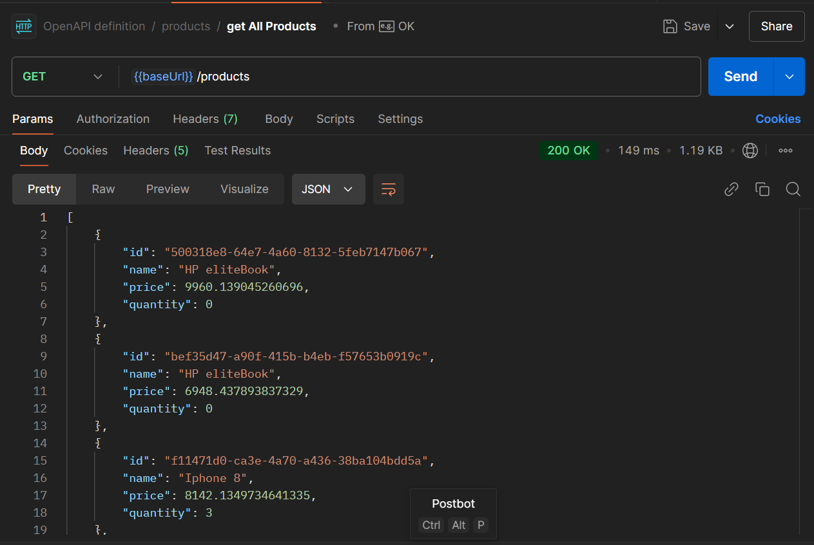
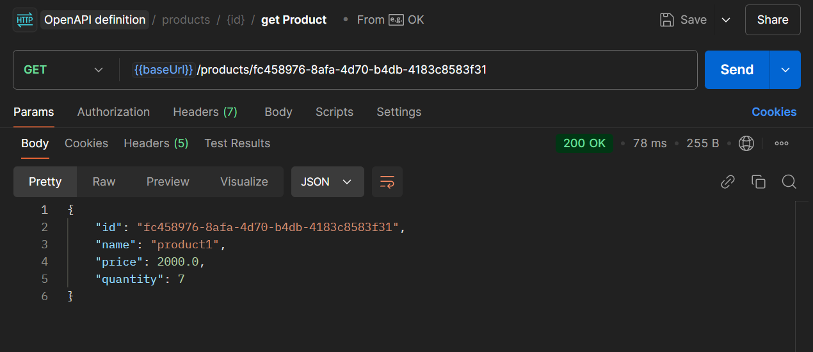
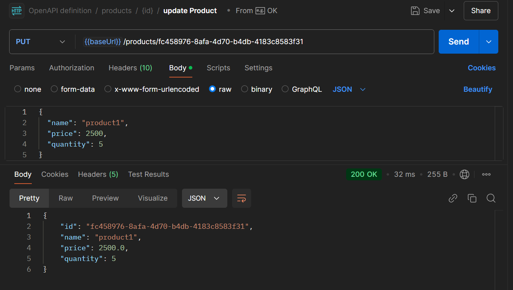

# Spring data Cassandra


## Cassandra cluster

### compose file

```yaml
services:
  cassandra:
    image: cassandra:latest
    container_name: cassandra
    ports:
      - "9042:9042"
    environment:
      CASSANDRA_CLUSTER_NAME: my_cluster
      CASSANDRA_DC: datacenter1
      CASSANDRA_NUM_TOKENS: 256
      CASSANDRA_SEEDS: cassandra
    volumes:
      - cassandra_data:/var/lib/cassandra
volumes:
  cassandra_data:

```


### Starting cluster

```shell
docker-compose up -d
```

### Create keyspace


```shell
docker exec -it <ID> cqlsh
```


create keyspace
```shell
create keyspace store with replication = {'class': 'SimpleStrategy', 'replication_factor': 1};
```


verification:


## Spring boot application


### Product

```java
package md.hajji.springcassandra.models;


import jakarta.annotation.PostConstruct;
import lombok.*;
import org.springframework.data.annotation.Id;
import org.springframework.data.cassandra.core.cql.PrimaryKeyType;
import org.springframework.data.cassandra.core.mapping.PrimaryKey;
import org.springframework.data.cassandra.core.mapping.PrimaryKeyColumn;
import org.springframework.data.cassandra.core.mapping.Table;

import java.util.UUID;

@Table("PRODUCTS")
@Getter @Setter @AllArgsConstructor @NoArgsConstructor @Builder
@ToString
public class Product {
    @Id
    @PrimaryKey
    private UUID id;
    private String name;
    private double price;
    private int quantity;
}

```


### ProductRepository

```java
package md.hajji.springcassandra.repositories;

import md.hajji.springcassandra.models.Product;
import org.springframework.data.cassandra.repository.CassandraRepository;

import java.util.UUID;

public interface ProductRepository extends CassandraRepository<Product, UUID> {
}

```


### ProductService

```java
package md.hajji.springcassandra.services;

import md.hajji.springcassandra.dtos.ProductDTO;
import md.hajji.springcassandra.models.Product;

import java.util.List;
import java.util.UUID;

public interface ProductService {

    Product create(ProductDTO productDTO);
    Product update(UUID id, ProductDTO product);
    void delete(UUID id);
    Product get(UUID id);
    List<Product> getAll();

}

```


```java
package md.hajji.springcassandra.services.impl;

import lombok.RequiredArgsConstructor;
import md.hajji.springcassandra.dtos.ProductDTO;
import md.hajji.springcassandra.models.Product;
import md.hajji.springcassandra.repositories.ProductRepository;
import md.hajji.springcassandra.services.ProductService;
import org.springframework.stereotype.Service;
import org.springframework.transaction.annotation.Transactional;

import java.util.List;
import java.util.UUID;
import java.util.function.Function;

@Service
@Transactional
@RequiredArgsConstructor
public class ProductServiceImpl implements ProductService {

    private final ProductRepository productRepository;


    @Override
    public Product create(ProductDTO productDTO) {

        if(productDTO.name() == null || productDTO.name().isBlank())
            throw new IllegalArgumentException("Name cannot be null or empty");

        if(productDTO.price() < 0)
            throw new IllegalArgumentException("Price cannot be negative");

        if(productDTO.quantity() < 0)
            throw new IllegalArgumentException("Quantity cannot be negative");

        Product product = Product.builder()
                .id(UUID.randomUUID())
                .name(productDTO.name())
                .price(productDTO.price())
                .quantity(productDTO.quantity())
                .build();

        return productRepository.save(product);
    }

    @Override
    public Product update(UUID id, ProductDTO product) {

        Product current = productRepository.findById(id)
                .orElseThrow(() -> new RuntimeException("Product not found"));


        if (product.name() != null && !product.name().isBlank())
            current.setName(product.name());

        if (product.price() > 0)
            current.setPrice(product.price());
        if (product.quantity() > 0)
            current.setQuantity(product.quantity());

        productRepository.save(current);

        return current;
    }


    @Override
    public void delete(UUID id) {
        productRepository.deleteById(id);
    }

    @Override
    public Product get(UUID id) {
        return productRepository.findById(id)
                .orElseThrow(() -> new RuntimeException("Product not found"));
    }

    @Override
    public List<Product> getAll() {
        return productRepository.findAll();
    }
}

```

### ProductFactory


```java
package md.hajji.springcassandra.utils;

import md.hajji.springcassandra.models.Product;

import java.util.ArrayList;
import java.util.List;
import java.util.Random;
import java.util.UUID;

public class ProductFactory {


    private static final List<String> NAMES =
            List.of("Iphone 8", "Pixel 6a", "HP eliteBook");

    private static final Random RANDOM = new Random();
    public static Product get(){

        return Product.builder()
                .id(UUID.randomUUID())
                .name(NAMES.get(RANDOM.nextInt(NAMES.size())))
                .quantity(RANDOM.nextInt(10))
                .price(RANDOM.nextDouble(10000))
                .build();
    }
}

```


### ProductDTO

```java
package md.hajji.springcassandra.dtos;

public record ProductDTO(
        String name,
        double price,
        int quantity
) {
}

```


### ProductController

```java
package md.hajji.springcassandra.web;


import lombok.RequiredArgsConstructor;
import md.hajji.springcassandra.dtos.ProductDTO;
import md.hajji.springcassandra.services.ProductService;
import org.springframework.http.HttpStatus;
import org.springframework.http.ResponseEntity;
import org.springframework.web.bind.annotation.*;

import java.util.List;
import java.util.UUID;

@RestController
@RequestMapping(path = "/products")
@RequiredArgsConstructor
public class ProductController {

    protected final ProductService productService;

    @GetMapping
    public ResponseEntity<?> getAllProducts() {
        return ResponseEntity.ok(productService.getAll());
    }


    @GetMapping(path = "{id}")
    public ResponseEntity<?> getProduct(@PathVariable("id") UUID id) {
        return  ResponseEntity.ok(productService.get(id));
    }

    @PostMapping
    public ResponseEntity<?> addProduct(@RequestBody ProductDTO productDTO) {
        return ResponseEntity.status(HttpStatus.CREATED)
                .body(productService.create(productDTO));
    }

    @PutMapping(path = "{id}")
    public ResponseEntity<?> updateProduct(@PathVariable("id") UUID id, @RequestBody ProductDTO productDTO) {
        return ResponseEntity.ok(productService.update(id, productDTO));
    }

    @DeleteMapping(path = "{id}")
    public ResponseEntity<?> deleteProduct(@PathVariable("id") UUID id) {
        productService.delete(id);
        return ResponseEntity.noContent().build();
    }
}

```


### Testing

```java
package md.hajji.springcassandra;

import md.hajji.springcassandra.repositories.ProductRepository;
import md.hajji.springcassandra.utils.ProductFactory;
import org.springframework.boot.CommandLineRunner;
import org.springframework.boot.SpringApplication;
import org.springframework.boot.autoconfigure.SpringBootApplication;
import org.springframework.context.annotation.Bean;

import java.util.stream.Stream;

@SpringBootApplication
public class SpringCassandraApplication {

    public static void main(String[] args) {
        SpringApplication.run(SpringCassandraApplication.class, args);
    }


    @Bean
    CommandLineRunner start(ProductRepository repository) {

        return args -> {
            Stream.generate(ProductFactory::get)
                    .limit(10)
                    .forEach(repository::save);
        };
    }

}

```


#### Application.properties file

```properties
spring.application.name=spring-cassandra
spring.cassandra.contact-points=127.0.0.1
spring.cassandra.port=9042
spring.cassandra.keyspace-name=store
spring.cassandra.local-datacenter=datacenter1
spring.cassandra.schema-action=recreate_drop_unused

```


### Results

#### Checking product table in store keyspace


#### Checking swagger documentation


#### Download Api documentation


#### Import Api documentation on Postman


#### Get all




#### Create


#### Get By ID




#### Update




#### Delete


